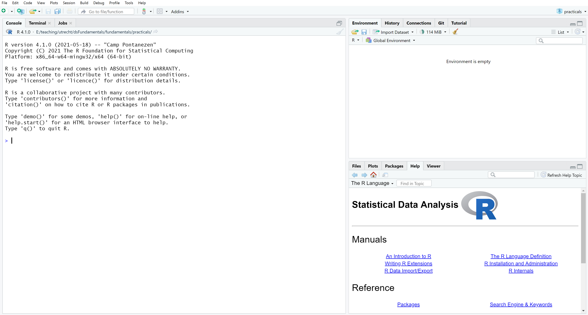

# Intro {.sidebar}

This tutorial covers basic R usage. 

---

<!----------------------------------------------------------------------------->

# Preparation

## Column 1

###

Hello, 

You have probably been directed to this page because you are participating in a 
course that requires R programming. In that course, you will most likely use 
both R and RStudio. This tutorial comprises three exercises that are intended to 
guide you through the initial steps of getting up-and-running with R. 

Before you can do any R programming, however, you will need to install R and 
RStudio. The steps below will guide you through installing both R and RStudio. 
Please do so before proceeding on to the exercises. 

Regards,  
[Kyle M. Lang](https://www.kylemlang.com)

### **System requirements**

You will need a computer for which you have full write access and administrator
rights. We will explore programming and compiling in this tutorial, so you will 
need full access to your machine. Some corporate computers (and university 
computers) restrict the access of their users. I therefore advise you to use a 
personal computer for this course, if possible. 

### **1. Install R**

You can obtain a copy of R [here](https://cran.r-project.org). We won't use 
R directly in this course. Rather, we'll call R through RStudio. Therefore, 
you also need to install RStudio. 

### **2. Install RStudio Desktop**

RStudio is an Integrated Development Environment (IDE) for R. You can 
download RStudio as stand-alone software [here](https://www.rstudio.com/products/rstudio/download/#download). 
You want the free, open-source `RStudio Desktop` version.

### **3. Start RStudio, and install packages**

Open RStudio, and copy-paste the following line of code into the console pane to 
install the packages you will need for the exercises.

- If nothing happens after you paste the code, try hitting the "Enter/Return" 
key.

```{r eval = FALSE, echo = TRUE}
install.packages(c("rmarkdown", "knitr", "dplyr", "mice"), dependencies = TRUE)
```

If you are not sure where to paste the code, use the following figure to 
identify the console.

- The console pane occupies the left half of the RStudio window shown in this 
image.

<center>
  
</center>

If you are asked the following:

```{r eval = FALSE, echo = TRUE}
Do you want to install from sources the package which needs 
compilation? (Yes/no/cancel)
```

Type `Yes` in the console, and press the "Enter/Return" key (or click the 
corresponding button if the question presents as a dialog box). 

## Column 2

### **What if the steps to the left do not work for me?**

If the suggested steps fail or you have insufficient rights on your machine, you 
can use the following web-based solutions. 

1. Open a free account on [rstudio.cloud](https://rstudio.cloud). 
   - You can run your own cloud-based RStudio environment there.
   
2. If you are a Utrecht University student, you can use Utrecht University's [MyWorkPlace](https://myworkplace.uu.nl/). 
   - You will have access to R and RStudio there. When you start a new 
   MyWorkPlace session, you may need to (re)install packages. 

Naturally, you will need internet access to use these services. 

<!----------------------------------------------------------------------------->

# Exercises

## Column 1

### R Exercises

This tutorial is broken into the following three exercises.

- [Exercise 1](exercises/exercise1.html)
- [Exercise 2](exercises/exercise2.html)
- [Exercise 3](exercises/exercise3.html)

### Solutions

Below, you can find suggested solutions for the above exercises. 

- [Exercise 1 Solutions](exercises/exercise1_solutions.html)
- [Exercise 2 Solutions](exercises/exercise2_solutions.html)
- [Exercise 3 Solutions](exercises/exercise3_solutions.html)

These solutions are provided so you can check your work and unstick yourself if
you really can't figure out one of the exercise questions. You should make a 
concerted effort to complete each exercise yourself before you view these 
solutions. You won't get much out of this tutorial if you skip right to the 
answers. 
